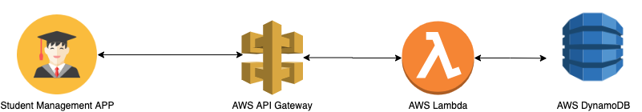

# student-management-app
Simple API using AWS Serverless Application Model (AWS SAM)  
Medium article: https://medium.com/@niyazabbasov/how-to-build-serverless-api-using-aws-serverless-application-model-aws-sam-965d9d9410d5

# backend
The following diagram is an overview of the components in the backend, and how they interact:

  

# prerequisites
Before start, you'll need to go through the installation guide page: 
https://docs.aws.amazon.com/serverless-application-model/latest/developerguide/serverless-sam-cli-install.html

# installation
To deploy the infrastructure run this command:  
`sam deploy --guided --template-file sam/student_infrastructure.yaml`

To import dummy data after installation run these commands:  
`cd dummy_data`  
`aws dynamodb batch-write-item --request-items file://students.json`
